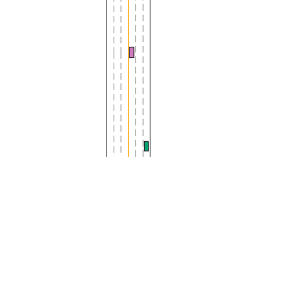

<h1 align="center">🏎️ Racing Car DQN with MetaDrive</h1>

<p align="center">
  A Deep Q-Network agent that learns to drive in the <a href="https://github.com/metadriverse/metadrive">MetaDrive</a> simulator.
</p>

<p align="center">
  
  
  
  
  
</p>

<p align="center">
  
  <br>
  <em>The trained agent driving in MetaDrive (top-down view).</em>
</p>

<!-- Optional: link a longer video instead of / in addition to the GIF
<p align="center">
  <a href="https://www.youtube.com/watch?v=YOUR_VIDEO_ID">
    
  </a>
</p>
-->

The agent receives MetaDrive's vector observation, chooses from six discrete driving actions, and learns a driving policy using experience replay, epsilon-greedy exploration, a target network, and a custom reward function focused on lane keeping, safe speed, smooth control, and reaching the destination.
Note: This project is far from being perfect. It has some major issues

## Table of Contents

- [Quick Start](#quick-start)
- [Overview](#overview)
- [Features](#features)
- [Results](#results)
- [Project Structure](#project-structure)
- [DQN Architecture](#dqn-architecture)
- [Reward Function](#reward-function)
- [Training Configuration](#training-configuration)
- [Installation](#installation)
- [Training](#training)
- [Evaluation and Recording a Demo](#evaluation-and-recording-a-demo)
- [Implementation Notes](#implementation-notes)
- [Known Limitations](#known-limitations)
- [Roadmap](#roadmap)
- [License](#license)

## Quick Start

```bash
git clone https://github.com/ma-nazari83/MetaDrive-DQN.git
cd MetaDrive-DQN
pip install -r requirements.txt

python test.py          # watch the pre-trained agent (race.pth) drive
python training.py      # train your own agent
```

## Overview

The project converts MetaDrive's continuous vehicle controls into a small discrete action space so that a DQN can be used for control.

The network maps a **259-dimensional observation** to Q-values for **6 possible actions**:

| Action                | Steering | Throttle                 |
| --------------------- | -------- | ------------------------ |
| Right + Accelerate    | Right    | Accelerate               |
| Right + Brake         | Right    | Brake / reduced throttle |
| Left + Accelerate     | Left     | Accelerate               |
| Left + Brake          | Left     | Brake / reduced throttle |
| Straight + Accelerate | Straight | Accelerate               |
| Straight + Brake      | Straight | Brake / reduced throttle |

During training, the selected discrete action is converted into the continuous control format expected by MetaDrive.

## Features

- Deep Q-Network implemented with PyTorch
- MetaDrive driving environment
- Six-action discrete control space
- Experience replay buffer
- Epsilon-greedy exploration
- Target Q-network with soft updates
- Gradient clipping
- Custom reward shaping
- CPU and CUDA support
- Saved PyTorch checkpoint for evaluation
- One-command demo recording (GIF / MP4) and evaluation stats

## Results

> Numbers below come from `python record_demo.py --episodes 20`. Replace the placeholders with your own output.

| Metric               | Value |
| -------------------- | ----- |
| Episodes evaluated   | _TBD_ |
| Success rate         | _TBD_ |
| Crash rate           | _TBD_ |
| Out-of-road rate     | _TBD_ |
| Mean episode reward  | _TBD_ |
| Mean speed (km/h)    | _TBD_ |

### Training curves

<!-- Once you log rewards during training, save plots to assets/ and uncomment:
<p align="center">
  
  
</p>
-->

_Coming soon: episode reward and success-rate plots._

## Project Structure

```
MetaDrive-DQN/
├── assets/            # demo.gif, plots, results.json
├── model.py           # DQN neural-network architecture
├── training.py        # Training loop, replay buffer, agent and reward function
├── test.py            # Checkpoint loading and rendered evaluation
├── record_demo.py     # Records episodes to GIF/MP4 and prints evaluation stats
├── race.pth           # Trained model checkpoint
├── requirements.txt   # Python dependencies
├── environment.yaml   # Conda environment export
└── README.md
```

## DQN Architecture

The Q-network in `model.py` is a fully connected neural network:

```
Input observation: 259
        │
        ▼
Linear(259, 128) → ReLU
        │
        ▼
Linear(128, 128) → ReLU
        │
        ▼
Linear(128, 6)
        │
        ▼
Q-value for each action
```

The action with the highest predicted Q-value is selected during exploitation.

## Reward Function

Training uses a custom reward function in addition to MetaDrive's step reward.

The reward encourages the agent to:

- maintain a reasonable driving speed,
- stay completely inside the lane,
- avoid large changes between consecutive controls,
- avoid crashes,
- stay on the road,
- avoid excessive speed, and
- reach the destination.

Large penalties are applied for crashes, leaving the road, and excessive speed, while reaching the destination receives a large positive reward. This shaping is intended to encourage safer and smoother driving instead of optimizing only forward progress.

## Training Configuration

| Parameter                         | Value              |
| --------------------------------- | ------------------ |
| Observation size                  | 259                |
| Number of actions                 | 6                  |
| Hidden-layer size                 | 128                |
| Replay-buffer capacity            | 10,000             |
| Batch size                        | 64                 |
| Discount factor (`gamma`)         | 0.99               |
| Learning rate                     | 0.0001             |
| Target-update coefficient (`tau`) | 0.005              |
| Initial epsilon                   | 1.0                |
| Minimum epsilon                   | 0.01               |
| Default training steps            | 200,000            |
| Loss                              | Mean Squared Error |
| Optimizer                         | Adam               |

The code automatically uses CUDA when a compatible GPU is available.

## Installation

Tested with Python 3.10 (PyTorch, NumPy, Pandas, MetaDrive).

```bash
conda create -n racing-car python=3.10
conda activate racing-car
pip install -r requirements.txt
```

## Training

```bash
python training.py                      # default: 200,000 steps
python training.py --train_steps 500000 # custom number of steps
```

After training, the Q-network weights are saved as `race.pth`.

## Evaluation and Recording a Demo

Watch the agent live in the simulator:

```bash
python test.py
```

Record a GIF and get evaluation statistics:

```bash
python record_demo.py --episodes 20            # writes assets/demo.gif + assets/results.json
python record_demo.py --mp4                    # also writes assets/demo.mp4
python record_demo.py --every 3 --width 480    # smaller file size
```

The script prints a Markdown table you can paste straight into the [Results](#results) section.

## Implementation Notes

**Experience replay.** Transitions `(state, action, reward, next_state, terminated, truncated)` are stored in a buffer of 10,000 samples. Newer transitions are given a higher sampling probability, which differs from standard uniform DQN replay and is treated as an experimental recency-prioritized strategy.

**Target network.** A separate target network stabilizes the Bellman targets and is updated softly:

```
target = tau × q_network + (1 - tau) × target      (tau = 0.005)
```

**Exploration.** Epsilon-greedy, decaying from 1.0 toward 0.01 so the learned Q-network gradually takes over from random exploration.

**Checkpoint.** `race.pth` holds the Q-network state dictionary. It is small enough to live in the repo; for larger checkpoints prefer Git LFS or GitHub Releases.

## Known Limitations

This is an experimental project and not a finished driving policy. Current known issues:

- _TODO: list the specific issues here, e.g. "agent struggles at sharp turns", "unstable behavior in dense traffic", "results vary a lot between random seeds"._
- No fixed random seeds, so runs are not fully reproducible.
- Recency-weighted replay is non-standard and has not been compared against uniform replay.

Contributions and suggestions are welcome, feel free to open an issue.

## Roadmap

- [ ] Reproducible random seeds
- [ ] Separate `train.py` and `evaluate.py` entry points
- [ ] Configurable hyperparameters (CLI / YAML)
- [ ] TensorBoard or Weights & Biases logging
- [ ] Episode reward and success-rate plots
- [ ] Evaluation over multiple random seeds
- [ ] Uniform / standard prioritized experience replay
- [ ] Double DQN and Dueling DQN
- [ ] Reward-function ablation experiments
- [x] Demonstration GIF in this README

## License

Distributed under the MIT License. See `LICENSE` for details.
